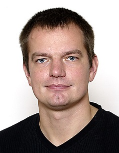

## People
Yop is maintained and developed at the Division of Vehicular Systems at Linköping University.

### Viktor Leek
Viktor is currently a PhD student at the Division of Vehicular Systems at Linköping University, working of optimal control of vehicle propulsion. Viktor has an MSc in Computer Science and Engineering, as well as an MSc in Electrical Engineering, both from Linköping University. Viktor is the developer of the Yop toolbox.

Viktor Leek - The developer of the Yop toolbox.

### Dennis Edblom
Dennis is currently a Masters student at Linköping University specializing in control systems. He has a BSc in Applied Physics and Electrical Engineering. Dennis has developed the Yop testing framework, the Yop website, and most of the examples.

Dennis Edblom - a smart guy and Yoptimization expert.

### Professor Lars Eriksson
Lars is a Professor at the Vehicular Systems Division at Linköping University. He is the initiator of the Yop toolbox and has done much research within the field of numerical optimal control of engines and vehicle propulsion.

Professor Lars Eriksson - The initiator of the Yop toolbox. 

## Funding
This work was supported by the Swedish Energy Agency,
Strategic Vehicle Research and Innovation (FFI), and Scania
CV AB.

### Is Yop for you?
If you have something to optimize, why not Yoptimize.
