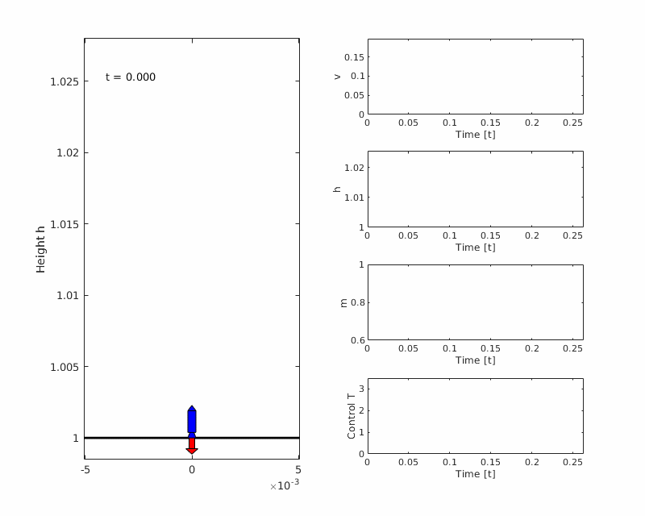
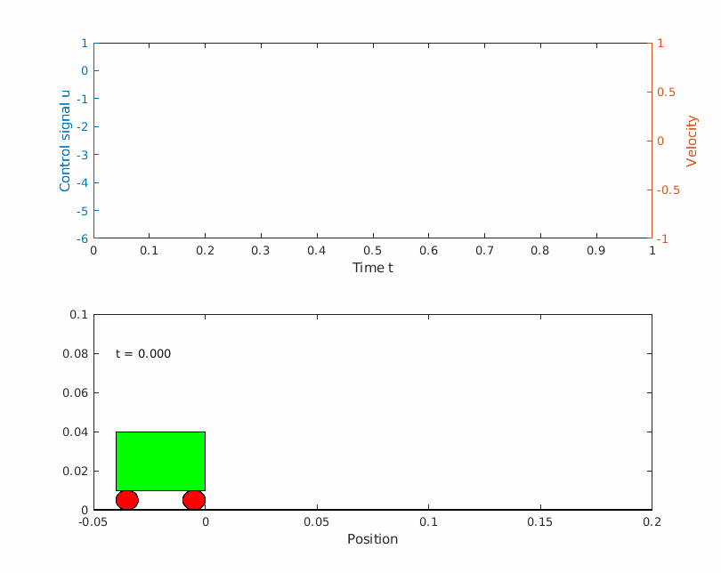
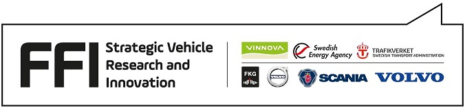

<!--  -->
<html>

 
 
Yop - optimal control made simple

 
A MATLAB Toolbox for Numerical Optimal Control based on CasADi.

 
<a type="button" href="install" class="btn btn-default" aria-label="Left Align"> Download Yop </a>

</html>

<!-- Marketing Icons Section -->

	

		<h1 class="page-header">
			Why use Yop?
		</h1>
	

	

		

			

				<h4><i class="fa fa-fw fa-check"></i> Easy to use</h4>
			

			

				
Yop is easy to use and has an intuitive syntax which makes it easy to get an overview of your code. Yop lets you express your problems as continuous time optimal control problems without losing functionality. This makes it easy to get an overview of the code. Yop also makes it easy to plot, where you easily can plot your states or make new expressions to plot. 

				<a href="#" class="btn btn-default">Learn More</a>
			

		

	

	

		

			

				<h4><i class="fa fa-fw fa-compass"></i> Plug and play</h4>
			
 
			

				
Use your existing ODE models with little or no modification. Yop acts as a addition to your workflow so you can just try it out without having to rethink your workflow.

				<a href="#" class="btn btn-default">Learn More</a>
			

		

	

	

		

			

				<h4><i class="fa fa-fw fa-gift"></i> Free &amp; Open Source</h4>
			

			

				
Yop is free and open source, so you can just download it and try it for yourself.

				<a href="#" class="btn btn-default">Learn More</a>
			

		

	

<!-- /.row -->

<!-- Features Section -->

		<h1 class="page-header">Use cases</h1>
	

	

		<h2>Goddard rocket</h2>
		
Lorem ipsum dolor sit amet, consectetur adipisicing elit. Sed voluptate nihil eum consectetur similique? Consectetur, quod, incidunt, harum nisi dolores delectus reprehenderit voluptatem perferendis dicta dolorem non blanditiis ex fugiat.

		
Lorem ipsum dolor sit amet, consectetur adipisicing elit. Saepe, magni, aperiam vitae illum voluptatum aut sequi impedit non velit ab ea pariatur sint quidem corporis eveniet. Odit, temporibus reprehenderit dolorum!

		
Lorem ipsum dolor sit amet, consectetur adipisicing elit. Et, consequuntur, modi mollitia corporis ipsa voluptate corrupti eum ratione ex ea praesentium quibusdam? Aut, in eum facere corrupti necessitatibus perspiciatis quis?

	

	

		
	

<!-- /.row -->

<!-- Intro Content -->

	

		
	

	

		<h2>Bryson Denham</h2>
		
Lorem ipsum dolor sit amet, consectetur adipisicing elit. Sed voluptate nihil eum consectetur similique? Consectetur, quod, incidunt, harum nisi dolores delectus reprehenderit voluptatem perferendis dicta dolorem non blanditiis ex fugiat.

		
Lorem ipsum dolor sit amet, consectetur adipisicing elit. Saepe, magni, aperiam vitae illum voluptatum aut sequi impedit non velit ab ea pariatur sint quidem corporis eveniet. Odit, temporibus reprehenderit dolorum!

		
Lorem ipsum dolor sit amet, consectetur adipisicing elit. Et, consequuntur, modi mollitia corporis ipsa voluptate corrupti eum ratione ex ea praesentium quibusdam? Aut, in eum facere corrupti necessitatibus perspiciatis quis?

	

<!-- /.row -->

# Founding
This work was supported by the Swedish Energy Agency, Strategic Vehicle Research and Innovation (FFI), and Scania CV AB.

	

		
	

