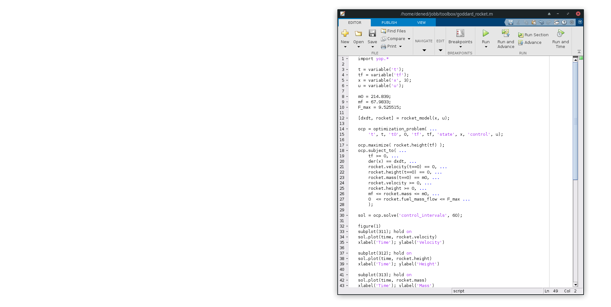

<!--  -->
<html>

<a href="https://i.ytimg.com/vi/MPV2METPeJU/maxresdefault.jpg">
 
 
Yop - optimal control made simple

 

 
<button type="button" class="btn btn-default" aria-label="Left Align"> Download Yop </button>

</a>

</html>

<!-- <a target="_blank" class="noCrossRef" href="{{ "https://github.com/yoptimization/yop/releases"}}"><button type="button" class="btn btn-default" aria-label="Left Align"> Download Yop </button></a> -->

Yop is a MATLAB Toolbox for Numerical Optimal Control based on CasADi.

<!-- Buzzwords:
easy to use, flexible, friendly abstracted user interface, intuitive,  -->

<html>

        

            <h2 class="page-header">Use Cases</h2>
        

        

            

                

                    
                          <i class="fa fa-circle fa-stack-2x text-primary"></i>
                          <i class="fa fa-tree fa-stack-1x fa-inverse"></i>
                    
                

                

                    <h4>Easy to use</h4>
                    
Yop has an intuitive syntax, can easily fit into the workflow of an engineer and makes tasks such as plotting easier.

                    <a href="#" class="btn btn-primary">Learn More</a>
                

            

        

        

            

                

                    
                          <i class="fa fa-circle fa-stack-2x text-primary"></i>
                          <i class="fa fa-car fa-stack-1x fa-inverse"></i>
                    
                

                

                    <h4>Flexible</h4>
                    
Express your problems as continuous time optimal control problems without losing functionality.

                    <a href="#" class="btn btn-primary">Learn More</a>
                

            

        

        

            

                

                    
                          <i class="fa fa-circle fa-stack-2x text-primary"></i>
                          <i class="fa fa-support fa-stack-1x fa-inverse"></i>
                    
                

                

                    <h4>Modelling</h4>
                    
Yop lets you use your existing ODE models, so that you can just jump in and start optimizing them.

                    <a href="#" class="btn btn-primary">Learn More</a>
                

            

        

        

            

                

                    
                          <i class="fa fa-circle fa-stack-2x text-primary"></i>
                          <i class="fa fa-database fa-stack-1x fa-inverse"></i>
                    
                

                

                    <h4>Optimizing</h4>
                    
Easy to setup and test different optimal control problems so you get the solution you are after. 

                    <a href="#" class="btn btn-primary">Learn More</a>
                

            

        

    

    </html>

## Easy to use
Yop has an intuitive syntax, can easily fit into the workflow of an engineer and makes tasks such as plotting easier.

## Flexible
Express your problems as continuous time optimal control problems without losing functionality.

## Modelling
Yop lets you use your existing ODE models, so that you can just jump in and start optimizing them.

## Optimizing
Easy to setup and test different optimal control problems so you get the solution that you're after. 

<!-- ## Optimization as the reason for improvement.
If you have a system that works it can be hard to motivate an improvement. You have to weight the potential gain versus the cost of implementation, this can be very hard since the magnitude of the potential gain can be unknown. If you then optimize the system you can get a benchmark on the potential gain and with that motive the change. TODO: fix sentences!

When creating a system or updating an old one you have to motivate why your solution i 

When updating an old system you have to weight the potential gain of the update against the cost of implementing it. It can be hard to know what th potential gain could be without getting the time to work on a solution. 

potential gain versus cost of implementation 

Optimal control does not have to be the solution but it can be the benchmark for your solution. Weighting the costs is not only for optimal control but one must do it when deciding on the 

The benchmark can be used to show how close your solution is to the optimal one. Or it can be used to motivate an improvement of a system.
If you have a system and a regulator it is hard to know how good the system is. With the help of  -->