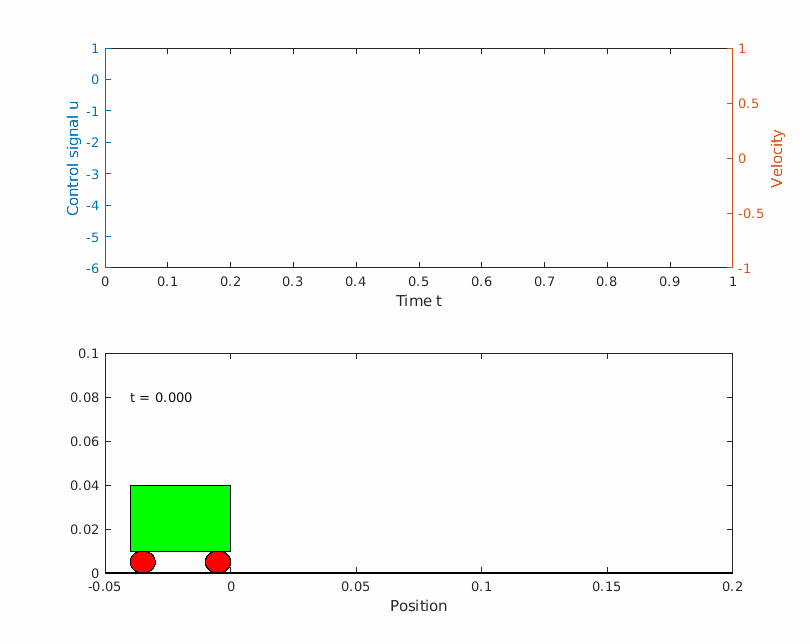
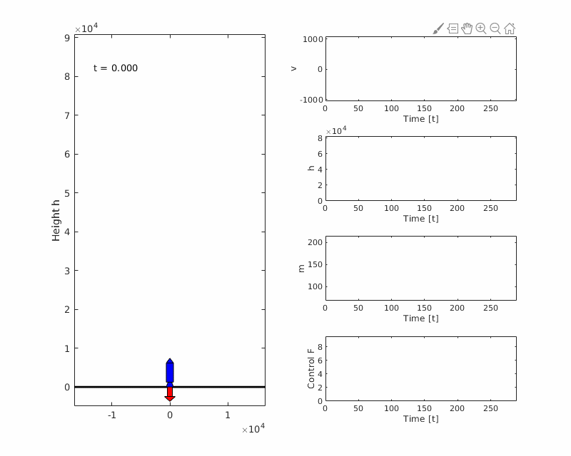

## [Bryson-Denham problem](https://www.yoptimalcontrol.se/brysonDenham){:target="_blank"}
The Bryson-Denham problem is a classical minimum energy optimal control problem.

## [Goddard Rocket](https://www.yoptimalcontrol.se/goddardLanding){:target="_blank"}
The Goddard rocket problem is an optimal control problem where the goal is to maximize the altitude of a vertically launched rocket.

## [A Linear Problem With Bang Bang Control](https://www.yoptimalcontrol.se/bangFreeTf){:target="_blank"}
Simple linear problem.

## [Greenhouse Climate Control](https://www.yoptimalcontrol.se/greenhouse){:target="_blank"}
Controlling the temperature in a greenhouse to maximize yield. This problem introduces external input.

## [Isoperimetric Constraint Problem](https://www.yoptimalcontrol.se/isoConstraint){:target="_blank"}
Example showing how to implement isoperimetric constraints.

## [Nondifferentiable system](https://www.yoptimalcontrol.se/nonDiff){:target="_blank"}
Example of a nondifferentiable system.

## [Transient optimization of Diesel-electric Powertrain](https://www.yoptimalcontrol.se/transientOptimization){:target="_blank"}
Example of optimizing the transient response of a diesel-electric powertrain when an increase in the generator electrical power is required.